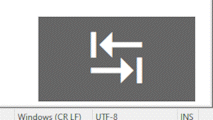

# Key Bubble
Chương trình hiển thị keystrokes.

Cài đặt thư viện cần thiết:

```python
pip install -r requirements.txt
```

Chạy chương trình:

```python
python KeyBubbles.py
```
Hoặc, mở file `KeyBubbles.exe` để chạy trực tiếp.
Tắt chương trình bằng cách: Chuột trái vào chương trình -> `Alt+F4`

> ***Chương trình thực hiện bắt sự kiện người dùng bấn phím chỉ phục vụ cho việc hiển thị. Chương trình không ghi lại bất kỳ hoạt động nào của người dùng.***

## Chương trình khi thực thi
